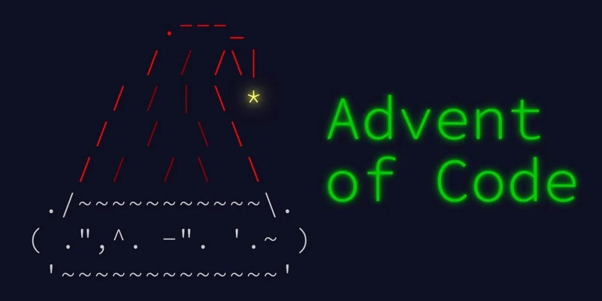

## Advent of Code Solutions (2015–2025)


- - -
# 📚 Overview

**Advent of Code (AoC)** is a yearly series of programming puzzles that challenge problem-solving, algorithmic thinking, and creativity.


This repository documents my journey through multiple editions, featuring:

*   Cleanly structured C# projects per year (`AdventOfCode.YearYYYY`)
*   Centralized shared utilities and analyzers
*   Automated testing for every solution
*   A custom **CLI tool** for running and managing daily challenges

- - -

## 🎄 Advent of Code Solutions (2015–2025)

This repository contains my solutions for the [Advent of Code](https://adventofcode.com) programming puzzles — an annual event of daily coding challenges that run each December from **2015 to 2025**.

Each folder corresponds to a specific year’s puzzles, implemented using a modular, testable architecture built on **.NET**.

- - -

## ⚙️ Tech Stack

*   **Language:** C# (.NET 8+)
*   **Framework:** .NET SDK
*   **Testing:** MSTest
*   **Style Checks:** StyleCop, Roslyn Analyzers
*   **CLI Interface:** Custom tool built with `System.CommandLine`
*   **Automation:** GitHub Actions (for CI/CD and static analysis)

- - -

## 🚀 CLI Usage

This repository includes a command-line tool (`AdventOfCode.Cli`) to quickly run and test daily challenges.

### Run Today’s Challenge

```
dotnet run --project tools/AdventOfCode.Cli today
```

### List Available Solutions

```
dotnet run --project tools/AdventOfCode.Cli list
```

### Pick a Specific Day

```
dotnet run --project tools/AdventOfCode.Cli pick --year 2023 --day 14
```

### Run All Solutions

```
dotnet run --project tools/AdventOfCode.Cli all
```

- - -

## 🧪 Running Tests

All problems include unit tests to validate correctness and performance.

```
dotnet test
```

You can also run tests for a specific year:

```
dotnet test tests/AdventOfCode.Year2024.Tests
```

- - -

## 🛠️ Creating a New Day

To scaffold a new day’s template:

```
./Create-Day.ps1 -Year 2025 -Day 1
```

This script automatically:

*   Creates boilerplate files for the new day
*   Updates project references
*   Prepares an empty test class

- - -

## 🧩 Project Philosophy

> “Code clarity first — performance second.”

Each year’s solutions emphasize:

*   **Readability:** easy-to-follow logic for both parts of each problem.
*   **Reusability:** common helpers live in `AdventOfCode.Shared`.
*   **Testing:** every puzzle validated with sample and real inputs.
*   **Automation:** scripts simplify creating and running new challenges.

- - -

## 📆 Years Covered

| Year | Stars Earned | Notes |
| --- | --- | --- |
| 2015 | ⭐⭐⭐⭐⭐ | The beginning! Simple warm-ups. |
| 2016 | ⭐⭐⭐⭐ | Logic puzzles & pathfinding. |
| 2017 | ⭐⭐⭐⭐⭐⭐ | Strong focus on parsing and recursion. |
| 2018 | ⭐⭐⭐⭐⭐ | Grid and simulation heavy. |
| 2019 | ⭐⭐⭐⭐ | Intcode machine implementation. |
| 2020 | ⭐⭐⭐⭐⭐⭐ | Focused on performance & optimization. |
| 2022 | ⭐⭐⭐⭐ | String manipulation and pattern detection. |
| 2023 | ⭐⭐⭐⭐⭐ | Graphs, dynamic programming & BFS. |
| 2024 | ⭐⭐⭐ | Experimental, ongoing. |
| 2025 | 🚧  | Work in progress! |

- - -

## 💡 Highlights

*   Custom-built AoC CLI runner
*   Modular architecture with shared base classes
*   Consistent coding style enforced by analyzers
*   Fully automated unit test coverage per year
*   Yearly progress tracking

- - -

## 📜 License

This project is licensed under the [MIT License](./LICENSE).

- - -

## 🎁 Acknowledgements

Special thanks to [Eric Wastl](https://adventofcode.com/about) for creating **Advent of Code**,  
and to the AoC community for inspiration, discussions, and creative problem-solving each December.

- - -

### 🧠 “25 days. 50 problems. Infinite learning.”
